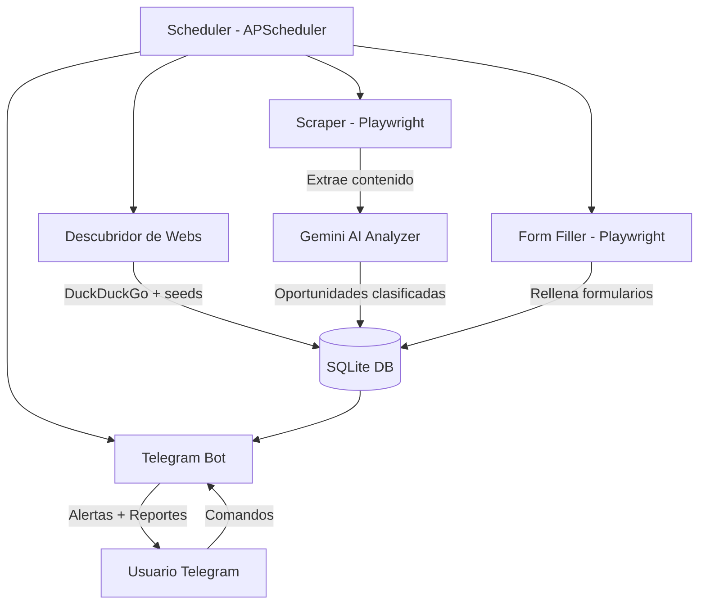

# Bot de Vivienda Madrid - Buscador de Cooperativas y Constructoras

## Stack Tecnologico

- **Lenguaje**: Python 3.11+
- **Scraping/Automatizacion**: Playwright (navegador headless - soporta webs con JS)
- **IA**: Google Gemini 2.5 Flash-Lite (gratis: 1,000 peticiones/dia, 15/min)
- **Notificaciones**: Telegram Bot API (gratis, ilimitado)
- **Base de datos**: SQLite (sin servidor, fichero local)
- **Busqueda web**: `duckduckgo-search` (gratis, sin API key, alternativa a Google Search)
- **Scheduler**: APScheduler (ejecucion periodica dentro del script)

## Arquitectura




## Estructura del Proyecto

```
house-bot/
  main.py                  # Entry point + scheduler
  config.py                # Variables de entorno (.env)
  requirements.txt
  .env.example
  db/
    database.py            # Setup SQLite + queries
    models.py              # Dataclasses para sites, opportunities, forms
  discovery/
    searcher.py            # Busqueda en DuckDuckGo
    seed_sites.py          # Lista semilla de webs conocidas
  scraper/
    scraper.py             # Scraping con Playwright
    analyzer.py            # Analisis con Gemini del contenido
  forms/
    detector.py            # Detectar formularios en paginas
    filler.py              # Rellenar y enviar formularios
    registry.py            # Registro de formularios (estado)
  ai/
    gemini_client.py       # Cliente Gemini (google-generativeai)
  notifier/
    telegram_bot.py        # Bot Telegram (envio + comandos)
  README.md
```

## Base de Datos (SQLite)

Tres tablas principales:

- **sites**: URL, nombre, zona (norte/este/oeste), tipo (cooperativa/constructora), fecha descubrimiento, ultima visita, activo
- **opportunities**: site_id, titulo, descripcion, precio_estimado, zona, estado (nueva/en_curso/proxima), fecha_deteccion, puntuacion_ia
- **form_submissions**: site_id, url_formulario, estado (pendiente/enviado/error), datos_enviados, fecha_envio, screenshot_path

## Modulos Detallados

### 1. Discovery (`discovery/`)

- `seed_sites.py`: Lista hardcodeada de webs conocidas:
  - cooptima.es, aurora-homes.es, idealista.com (obra nueva Madrid), concovi.org
  - Portales: fotocasa.es, pisos.com (seccion cooperativas)
  - Constructoras conocidas en Madrid norte/este/oeste
- `searcher.py`: Usa `duckduckgo-search` con queries como:
  - "cooperativa vivienda Madrid norte 2026"
  - "constructora obra nueva Alcobendas"
  - "cooperativa vivienda Vallecas este Madrid"
  - Gemini genera queries de busqueda optimizadas periodicamente

### 2. Scraper (`scraper/`)

- `scraper.py`: Playwright navega cada site, extrae HTML limpio
- `analyzer.py`: Envia contenido a Gemini con prompt estructurado para extraer:
  - Nombre del proyecto, ubicacion, precio, plazos
  - Si hay formulario de contacto/inscripcion
  - Clasificacion: oportunidad actual vs futura
  - Puntuacion de interes (1-10)

### 3. Form Automation (`forms/`)

- `detector.py`: Identifica formularios en las paginas (Playwright + Gemini)
- `filler.py`: Datos personales del usuario (desde .env) se rellenan automaticamente
  - Antes de enviar, toma screenshot como evidencia
  - Guarda en DB el estado del envio
- `registry.py`: Consulta el estado de todos los formularios, genera resumen

### 4. AI (`ai/`)

- `gemini_client.py`: Wrapper sobre `google-generativeai`
  - Modelo: `gemini-2.5-flash-lite` (1,000 RPD gratis)
  - Funciones: analizar pagina, clasificar oportunidad, generar queries de busqueda, decidir si rellenar formulario

### 5. Notifier (`notifier/`)

- `telegram_bot.py`: Bot con comandos interactivos:
  - `/start` - Bienvenida
  - `/oportunidades` - Lista oportunidades activas
  - `/futuras` - Proximos lanzamientos
  - `/formularios` - Estado de formularios (rellenados/pendientes)
  - `/buscar` - Forzar busqueda inmediata
  - `/reporte` - Resumen completo formateado bonito
  - Alertas automaticas cuando se detecta nueva oportunidad

### 6. Scheduler (`main.py`)

- Cada 6 horas: scraping de sites conocidos
- Cada 24 horas: busqueda de nuevos sites
- Cada 12 horas: intento de rellenar formularios pendientes
- Cada lunes: reporte semanal automatico por Telegram

## Requisitos del Usuario

Para funcionar, el usuario necesita configurar en `.env`:

- `GEMINI_API_KEY` - Gratis desde aistudio.google.com
- `TELEGRAM_BOT_TOKEN` - Gratis desde @BotFather en Telegram
- `TELEGRAM_CHAT_ID` - ID del chat donde recibir mensajes
- Datos personales para formularios: nombre, email, telefono, etc.

## Dependencias Principales

```
playwright
google-generativeai
python-telegram-bot
duckduckgo-search
beautifulsoup4
apscheduler
python-dotenv
aiosqlite
```

